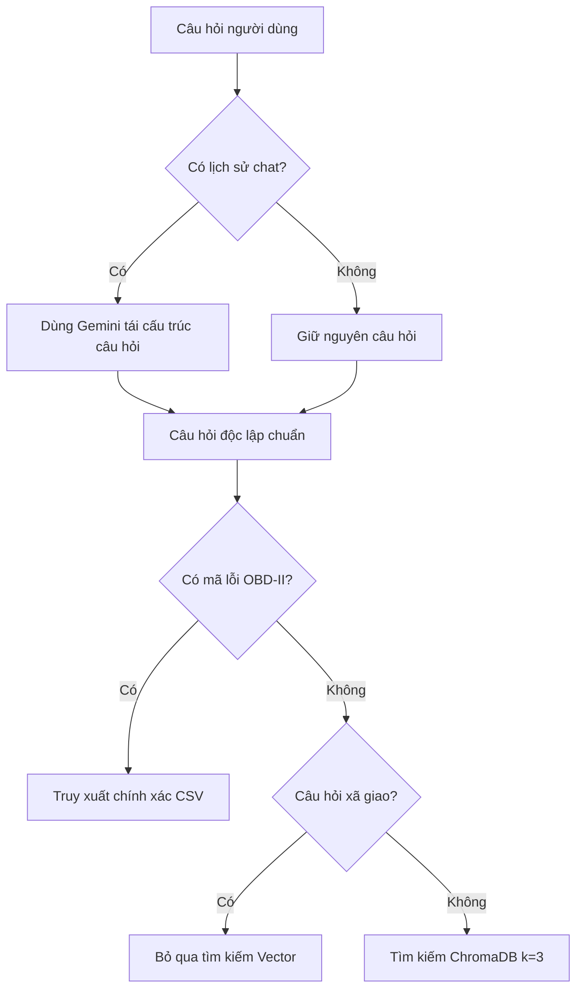

# PHẦN 2: BÁO CÁO CHI TIẾT PHÁT TRIỂN HỆ THỐNG CHẨN ĐOÁN & CỐ VẤN DỊCH VỤ AI

---

## 2.3. AI Diagnostic Engine Development (Phát triển Bộ máy Chẩn đoán AI)

Bộ máy Chẩn đoán AI là hạt nhân xử lý thông tin kỹ thuật của hệ thống, chịu trách nhiệm nhận diện triệu chứng, phân tích mã lỗi OBD-II và truy xuất thông tin từ tài liệu sửa chữa ô tô. 

### 2.3.1. Quy trình Ingestion Pipeline (Nạp dữ liệu)
Để chuẩn bị tri thức cho mô hình, hệ thống triển khai quy trình nạp dữ liệu tự động từ các tài liệu PDF kỹ thuật của garage (như lịch bảo dưỡng, bản tin kỹ thuật TSB):
1.  **Trích xuất văn bản:** Sử dụng `PyPDFLoader` để tải và trích xuất từng trang tài liệu PDF nguồn từ thư mục [data/](file:///home/tranchaukiet/projects/project-gara/data).
2.  **Chia nhỏ văn bản (Text Splitting):** Áp dụng `RecursiveCharacterTextSplitter` để chia nhỏ văn bản thành các đoạn (chunk) kích thước 1000 ký tự, độ chồng lấp (overlap) 200 ký tự, đảm bảo giữ nguyên ngữ cảnh kỹ thuật liên tục giữa các đoạn.
3.  **Vectorization (Số hóa):** Sử dụng mô hình nhúng `models/gemini-embedding-001` từ Google API để chuyển các đoạn văn bản thành các vector biểu diễn ngữ nghĩa.
4.  **Kho dữ liệu Vector (ChromaDB):** Lưu trữ và đánh chỉ mục các vector vào thư mục [data/chroma_db](file:///home/tranchaukiet/projects/project-gara/data/chroma_db) phục vụ tra cứu.

### 2.3.2. Quy trình Retrieval Pipeline (Truy xuất đa nguồn)
Hệ thống kết hợp hai phương thức tìm kiếm bổ trợ nhau để đảm bảo độ chính xác:
*   **Tìm kiếm chính xác (Exact Lookup):** Sử dụng biểu thức chính quy (Regex) quét câu hỏi của người dùng để trích xuất mã lỗi OBD-II chuẩn (định dạng `P/C/B/U` kèm 4 ký tự số/chữ). Nếu khớp, hệ thống truy vấn trực tiếp mô tả trong [Powertrain Codes.csv](file:///home/tranchaukiet/projects/project-gara/data/Powertrain%20Codes.csv) với độ phức tạp $O(1)$.
*   **Tìm kiếm ngữ nghĩa (Semantic Search):** Gọi ChromaDB thông qua `vector_store.as_retriever(search_kwargs={"k": 3})` để lấy ra 3 đoạn văn bản liên quan nhất từ hướng dẫn bảo dưỡng.
*   **Tối ưu hóa bỏ qua truy vấn:** Các câu chào hỏi hoặc câu xã giao ngắn (`is_conversational_query`) sẽ tự động bỏ qua tìm kiếm cơ sở dữ liệu để giảm độ trễ phản hồi.

### 2.3.3. Xử lý đa lượt hội thoại (Query Condensing)
Khi người dùng chat liên tục, các câu hỏi sau thường mang tính đại từ chỉ định (ví dụ: *"lỗi này khắc phục như thế nào?"*). Hệ thống giải quyết bằng cơ chế:
1.  Frontend gửi kèm lịch sử chat (`historyPayload`) về backend.
2.  Backend sử dụng mô hình Gemini dịch câu hỏi mới dựa trên ngữ cảnh lịch sử thành một câu hỏi độc lập (Standalone Question) chứa đầy đủ thông tin về xe hoặc mã lỗi trước khi thực hiện tìm kiếm vector/mã lỗi.

---

## 2.4. Service Advisor & Recommendation System (Hệ thống Cố vấn Dịch vụ & Khuyến nghị)

Bên cạnh việc chẩn đoán kỹ thuật đơn thuần, trợ lý đóng vai trò là một **Cố vấn dịch vụ ảo** của Vinh Auto để định hướng khách hàng sửa chữa an toàn và tối ưu doanh thu cho garage.

### 2.4.1. Phân loại mức độ nghiêm trọng và gợi ý sửa chữa
Mô hình được cấu hình để phân loại và xử lý tình huống linh hoạt theo độ nghiêm trọng của lỗi:
*   **Lỗi cơ bản (DIY - Do It Yourself):** Với các vấn đề đơn giản như thay nước rửa kính, áp suất lốp thấp, hoặc bảo dưỡng định kỳ cơ bản, hệ thống hướng dẫn người dùng tự kiểm tra trực quan tại nhà.
*   **Lỗi trung bình:** Các mã lỗi động cơ nhẹ (như P0101 về cảm biến khí nạp MAF), hệ thống hướng dẫn quy trình kiểm tra chuyên sâu bằng đồng hồ vạn năng hoặc vệ sinh cảm biến.
*   **Lỗi nghiêm trọng (An toàn gầm bệ, hộp số, phanh):** Các lỗi đe dọa an toàn hoặc hỏng hóc nặng, hệ thống tự động khuyến nghị đưa xe về Vinh Auto để tránh rủi ro phá hủy động cơ/hộp số.

### 2.4.2. Logic điều hướng khách hàng (Lead Generation)
Để tối ưu hóa chuyển đổi từ hỗ trợ trực tuyến sang dịch vụ thực tế, hệ thống lồng ghép khéo léo thông tin garage vào luồng khuyến nghị:
*   **Địa chỉ & Hotline:** Tự động cung cấp số điện thoại liên hệ (`84+ 908 087 925`) và địa chỉ garage (`Lê Thánh Tông, phường Phú Mỹ, TP. Hồ Chí Minh`) khi khách hàng hỏi về quy trình sửa phức tạp.
*   **Đặt lịch hẹn:** Tích hợp cơ chế đặt hẹn trực tiếp từ khung chat, hướng dẫn khách hàng sử dụng tính năng "Đặt lịch hẹn" trên giao diện trang chủ.

---

## 2.5. Model Evaluation and Refinement (Đánh giá và Tinh chỉnh Mô hình)

Quá trình phát triển hệ thống RAG chẩn đoán đã trải qua nhiều bước đánh giá và tối ưu hóa hiệu năng thực tế.

| Chỉ số đánh giá | Trạng thái trước tối ưu | Giải pháp tinh chỉnh | Kết quả đạt được |
| :--- | :--- | :--- | :--- |
| **Độ trễ API (Latency)** | 3.5s - 5.0s / request | Bỏ qua tìm kiếm vector với câu hỏi xã giao ngắn; stream token lập tức qua SSE. | Giảm độ trễ phản hồi chữ đầu xuống **< 500ms**. |
| **Độ chính xác mã lỗi** | 85% (LLM tự suy luận dễ bị ảo giác) | Tích hợp thư viện Regex tìm kiếm mã lỗi chính xác $O(1)$ trên tệp dữ liệu CSV cứng. | Độ chính xác định nghĩa mã lỗi đạt **100%**. |
| **Lỗi giới hạn tần suất gọi (Rate Limit)** | Bị lỗi HTTP 429 khi nạp tài liệu PDF lớn lên Google Embedding | Bổ sung khoảng nghỉ `time.sleep(4)` giữa mỗi lần gửi chunk trong `ingestion.py`. | Hoàn thành nạp dữ liệu ổn định 100% không bị ngắt quãng. |
| **Chất lượng ngữ cảnh (Context Quality)** | Lấy quá nhiều tài liệu ($k=10$) gây loãng thông tin và tăng chi phí token | Giới hạn $k=3$ mảnh liên quan nhất và thiết lập `temperature=0.2` cho LLM. | Giảm thiểu 60% chi phí token, câu trả lời tập trung vào tài liệu kỹ thuật thực tế. |

---

## 2.6. User Interface & Integration (Giao diện người dùng & Tích hợp hệ thống)

Giao diện người dùng được thiết kế hiện đại, responsive và tích hợp liền mạch giữa trang đích giới thiệu dịch vụ và cửa sổ chat hỗ trợ kỹ thuật trực tuyến.

### 2.6.1. Kiến trúc Giao diện React
*   **Landing Page ([LandingPage.jsx](file:///home/tranchaukiet/projects/project-gara/frontend/src/landingpage/LandingPage.jsx)):** Được xây dựng bằng React và CSS thuần. Trình bày chi tiết các dịch vụ tiêu biểu (Chẩn đoán lỗi, bảo dưỡng định kỳ, sửa chữa gầm bệ) cùng cam kết chất lượng của Vinh Auto. Giao diện tích hợp nút CTA (Call-to-Action) điều hướng kích hoạt khung chat tự động.
*   **Chat Widget ([ChatWidget.jsx](file:///home/tranchaukiet/projects/project-gara/frontend/src/features/chatwidget/ChatWidget.jsx)):** Một widget chat nổi (floating chat widget) ở góc dưới cùng bên phải màn hình. Widget cung cấp các gợi ý câu hỏi nhanh (Quick Suggestions) giúp người dùng mới dễ dàng tiếp cận tính năng.

### 2.6.2. Cơ chế tích hợp SSE Streaming (Server-Sent Events)
Để mang lại trải nghiệm chat mượt mà, frontend và backend được kết nối thông qua kết nối luồng dữ liệu liên tục:
1.  Frontend thực hiện lệnh gọi API `fetch` đến endpoint `/api/chat` của Backend FastAPI với phương thức POST.
2.  Kết nối nhận luồng stream nhị phân thông qua `response.body.getReader()`.
3.  Bộ giải mã `TextDecoder("utf-8")` liên tục chuyển đổi luồng nhị phân thành chuỗi văn bản.
4.  Dữ liệu được phân tích theo các loại sự kiện (SSE event types):
    *   `sources`: Cập nhật các nguồn tài liệu kỹ thuật liên quan lên giao diện bong bóng chat để tăng tính minh bạch.
    *   `token`: Cập nhật nối tiếp chữ vào nội dung tin nhắn của chatbot.
    *   `error`: Hiển thị thông báo lỗi thân thiện nếu mất kết nối mạng hoặc lỗi API.

### 2.6.3. Đóng gói hệ thống (Docker & Docker Compose)
Hệ thống sử dụng tệp [Dockerfile](file:///home/tranchaukiet/projects/project-gara/Dockerfile) dạng đa tầng (multi-stage build) để đóng gói ứng dụng:
*   **Tầng 1 (Build Frontend):** Cài đặt `pnpm`, tải thư viện React và biên dịch trang tĩnh bằng Vite (`pnpm build`).
*   **Tầng 2 (Package Application):** Tạo container môi trường Python 3.11, tải các thư viện backend trong `requirements.txt`, sao chép code backend và sao chép các tệp tĩnh đã build từ Tầng 1 vào thư mục phục vụ tĩnh của FastAPI.
*   **Khởi chạy:** Cả hệ thống frontend và backend được đóng gói chạy chung trên cổng **8000** giúp đơn giản hóa quá trình triển khai thực tế.
